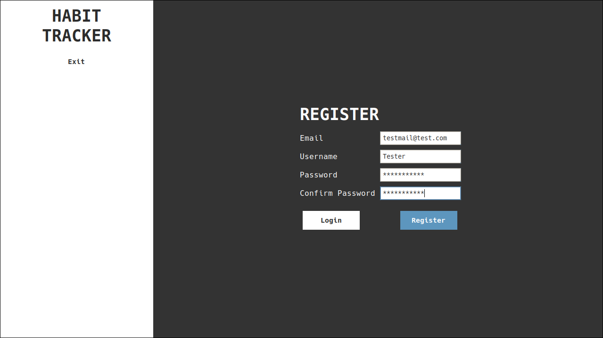
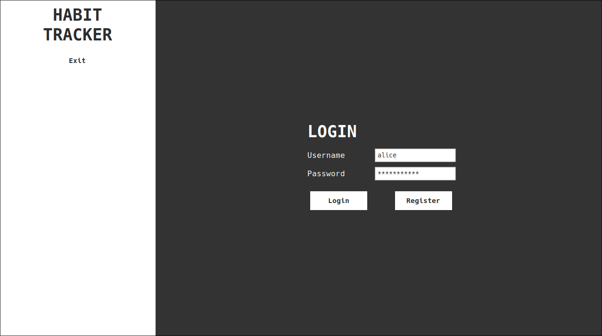
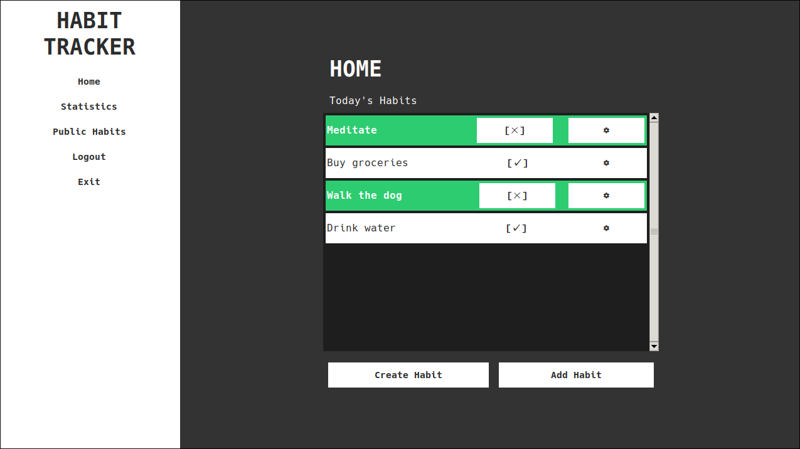
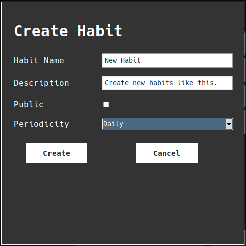
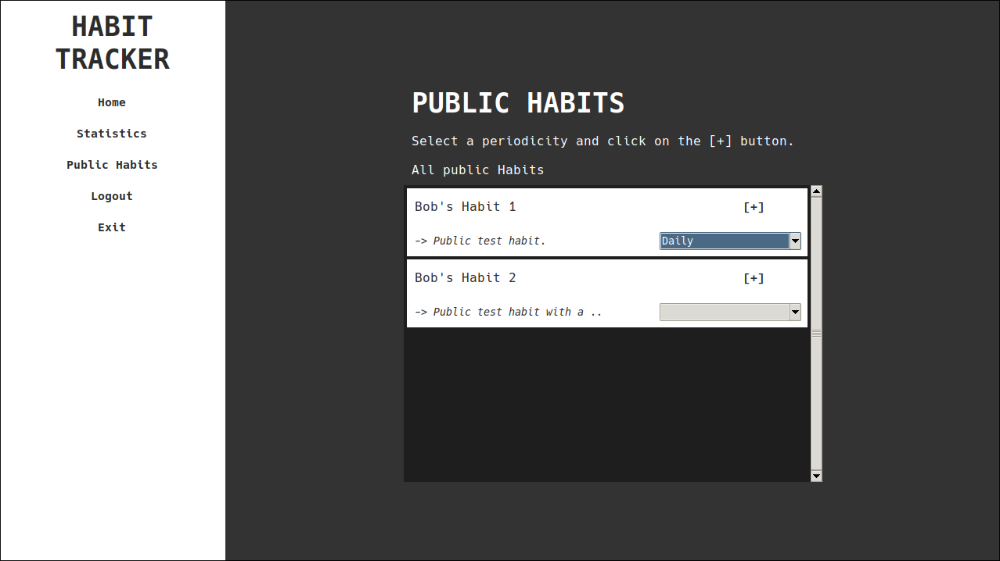
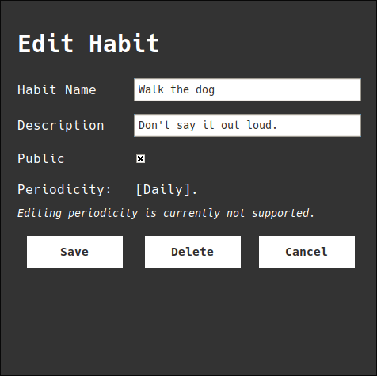
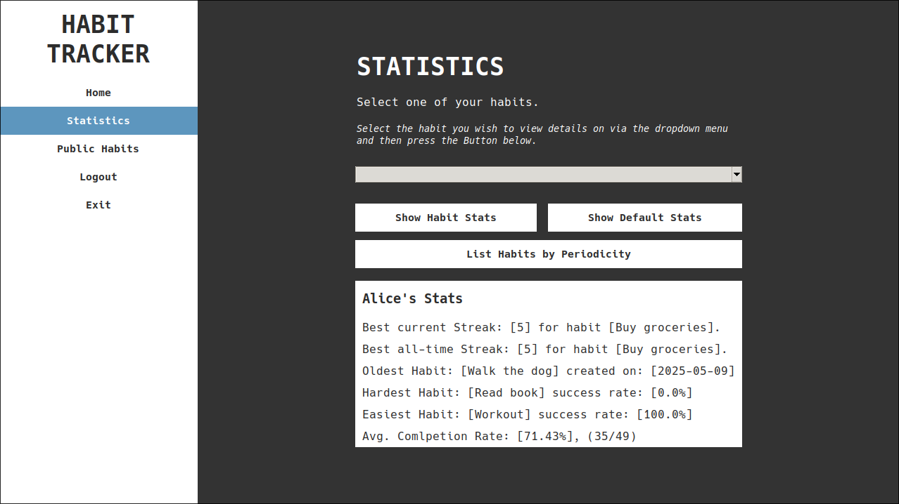
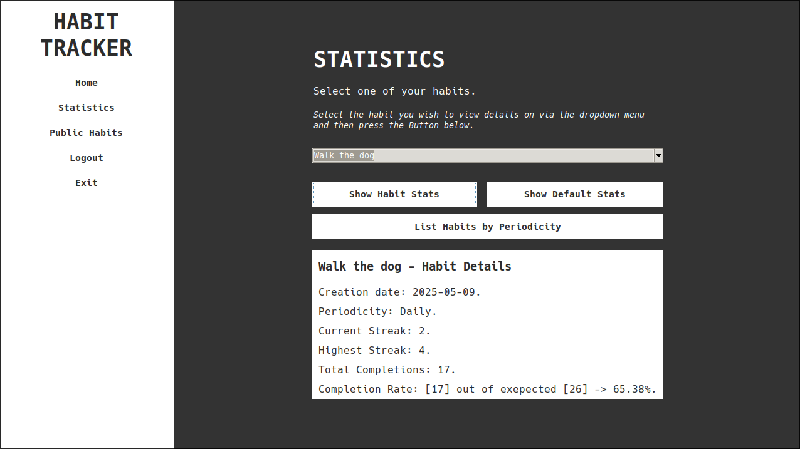
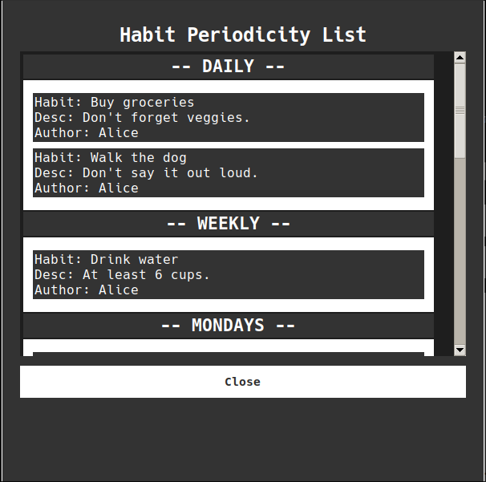

# Habit Tracker

> Developed as a university portfolio project for IU, Python Object-Oriented and Functional Programming (OOFP) module.

A Python-based Habit Tracking App built using basic `Python`, `sqlite3`, `Tkinter`.

Final Grade: *@tbd*

<br>

## 📋 Table of Contents

- [📌 Summary](#📌-summary)
- [✨ Features](#✨-features)
- [🚀 Usage Instructions](#🚀-usage-instructions)
- [🛠️ Installation Guide](#🛠️-installation-guide)
- [🐞 Known Issues](#🐞-known-issues)

<br>

## 📌 Summary

This application allows users to create, subscribe to, and manage habits.
Habits can be tracked daily, weekly, or on specific days.
Each habit is linked to user-specific progress, and optionally shared publicly.

This project's UI/UX is not great, the focus lies on backend functionality.

### Tools used

- Language: `Python 3.13+`
- GUI: `Tkinter`
- Database: `sqlite3`
- Package Manager: `Poetry`

<br>

## ✨ Features

> As the task is to create a prototype, the project a written in a very extensible and modular way, reducing coupling of objects and references.

- Structured GUI using `Tkinter` incl. screen base class & popup widgets.
- Split habit data and habit subscription structure.
  - Easily support public habits.
  - Deletion / Editing rules apply appropriately.
- Habit creation, deletion, editing.
- Track completion with streaks
- Customizable periodicity (daily, weekly, specific weekdays)
- Multi-user support
- Data persistence via SQLite3
- Database logger
- Database test dummy data (`--debug` flag when running script)
- Test unit
- Package Manager `Poetry` [(poetry docs)](https://python-poetry.org/docs/basic-usage/)

<br>

## 🚀 Usage Instructions

> While the UI/UX can definitely be improved, the GUI should be intuitive enough to make usage of the app fairly clear, nonetheless more detailed usage instructions are listed below.

### 1. Launch the application

- [Installation / Launch guide](#🛠️-installation-guide).
- Use the `--debug` argument to utilize test data.

### 2. Log in or register a user

- Users `alice` & `bob` are provided when using the test data.
- Password for both is simply 'password123'.
- The login information is also shown in the Terminal log when using the `--debug` argument.
- The `Login`/`Register` buttons swap the screen when on the 'wrong' screen or fulfill the action when already on the 'correct' screen.

  <details>
  <summary><strong>Image: Register Screen</strong></summary>

  ---

  

  ---

  </details>

  <details>
  <summary><strong>Image: Login Screen</strong></summary>

  ---

  

  ---

  </details>

### 3. Create habits, or subscribe to one in the public list

- On the Home screen you can view habits that are due today.
- Here you can also 'Create' or 'Add' new habits by clicking one of the buttons.
- Creating a new Habit will open a popup, selecting a periodicity and providing the required input will let you click the 'Create' button in the popup and the habit will be created and automatically subscribed to.
- Adding a new habit will lead you to the public habits screen from which you can subscribe to a habit by selecting a periodicity and clicking the `[+]` button on the listed habit widget.

  <details>
  <summary><strong>Image: Home Screen</strong></summary>

  ---

  

  ---

  </details>

  <details>
  <summary><strong>Image: Create Habit Popup</strong></summary>

  ---

  

  ---

  </details>

  <details>
  <summary><strong>Image: Public Habits Screen</strong></summary>

  ---

  

  ---

  </details>

### 4. Mark habits as completed

- On the Home screen (see above for image) you can mark your habits as done, by clicking the `[✓]` button on one of your listed subscribed habits.
- Can be undone via the `[✗]` button that's shown on completed habits.
- This will create/destroy a completion for the Habit Subscription.

### 5. Edit habits as necessary

- Clicking the `` button on a subscribed habit enables the user to edit the habit.
- The habit data entry is then modified with the newly input data.
- This propagates to all other users as well.
- As of now, only the author user can edit the habit, and the habit data database entry is then modified accordingly.
- There is currently no support for the periodicity setting.

  <details>
  <summary><strong>Image: Edit Habit</strong></summary>

  ---

  

  ---

  </details>

### 6. View statistics and track streaks & progress over time

- On the Statistics screen, the user can view their overall Statistics, as well as view a list of all their subscribed habits ordered by periodicity via the `List Habits by Periodicity` button (Opens popup window).
- Habit specific stats can be viewed by selecting a habit in the dropdown and clicking the `Show Habit Stats` button. This will update the screen to reflect the selected habits stats.
- The `Show Default Stats` button can be used to view the general user stats again, this will also be shown when re-opening the screen.

  <details>
  <summary><strong>Image: Default Statistics</strong></summary>

  ---

  

  ---

  </details>

  <details>
  <summary><strong>Image: Habit Statistics</strong></summary>

  ---

  

  ---

  </details>

  <details>
  <summary><strong>Image: Default Statistics</strong></summary>

  ---

  

  ---

  </details>

<br>

## Structure

> Rough introduction / documentation on how the project is built.

- General data flow is as follows: `GUI` (incl. widgets) ⇾ Objects (`User`/`HabitData`/`HabitSubscription`) ⇾ `RequestHandler` ⇾ `DBController`
  - This ensures that the database controller can be replaced somewhat easily without resulting in any of the object classes having to be changed.
  - The GUI holds a current user object variable which is used by any widgets spawned from the GUI for them to gain access to requests

<br>

## 🛠️ Installation Guide

> If you have any problems installing or running this program, please message me via my student email or Teams, so I can help.

<details>
<summary><strong>Linux</strong></summary>

### Linux Installation

1. Clone the repo:

    ```bash
    git clone https://github.com/your-repo/habit-tracker.git
    cd habit-tracker
    ```

2. Install requirements via `Poetry`

    ```bash
    poetry install
    ```

3. Launch the app

    ```bash
    poetry run python run.py
    ```

- If you have trouble with poetry or don't want to use it:
  - Currently the project only has 2 dependencies:
    - `Python >3.10`
    - `Tkinter`
  - Install these with your package manager
    - example (Arch-based):

    ```bash
    sudo pacman -S python, tk
    ```

  - Then just launch the app using:

    ```bash
    python run.py
    ```

</details>

<details>
<summary><strong>Windows</strong></summary>

### Windows Installation

1. Clone the repo:

    ```bash
    git clone https://github.com/your-repo/habit-tracker.git
    cd habit-tracker
    ```

2. Step 3 should be optional on Windows, due to `Tkinter` being included in every python installation. <br>
(If Python was installed via the binaries on their website)

3. (Install requirements via `Poetry`)

    ```bash
    poetry install
    ```

4. Launch the app
    - using poetry (enables virtual environment)

    ```bash
    poetry run python run.py
    ```

    - default python launch

    ```bash
    python run.py
    ```

</details>

You should now be able to [use](#🚀-usage-instructions) the app.

<br>

## 🐞 Known Issues

> List of currently known issues / bugs. These are low priority problems that may or may not be fixed after phase 2 depending on tutor feedback.

- ~~Editing `Periodicity` on habits via the `EditHabitPopup` doesn't apply~~
- GUI is not very responsive to different screen / window sizes.
- ~~Habit descriptions aren't really displayed anywhere useful in the GUI.~~
- Editing a habit to update public to false, i.e. making it private, does not unsubscribe other users from it. (Could create a new substitute habit with identical data)
- Subscriptions can be created with the same habit data, or different habit data with the same habit data name, which can be confusing..
- UX issue: can only access delete habit functionality via home screen. (thus can only delete if periodicity is relevant)
